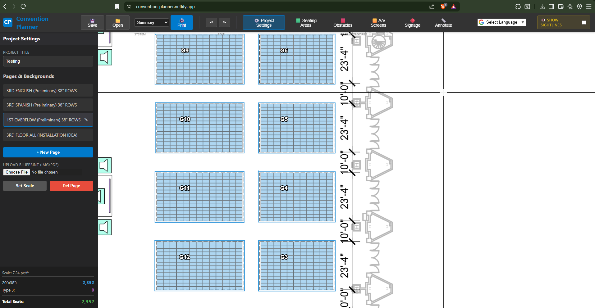
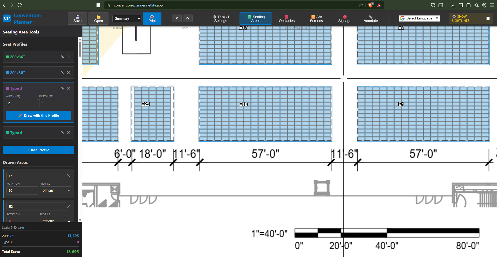
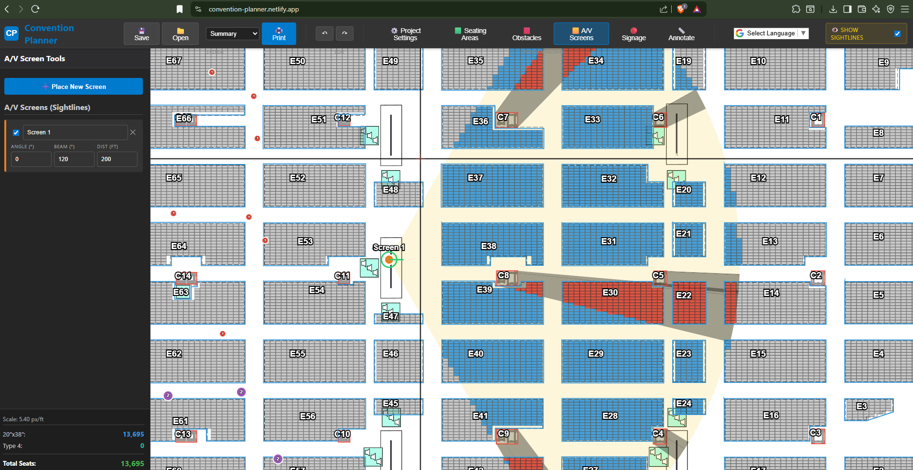
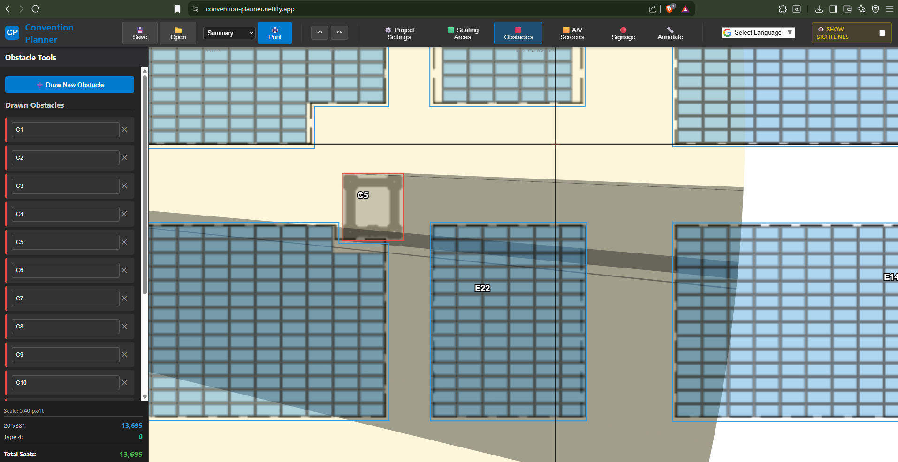
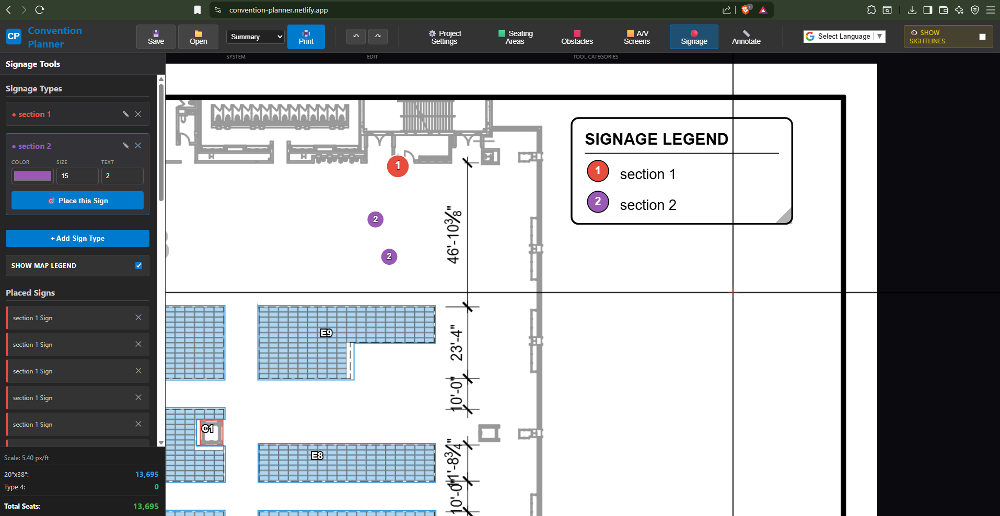
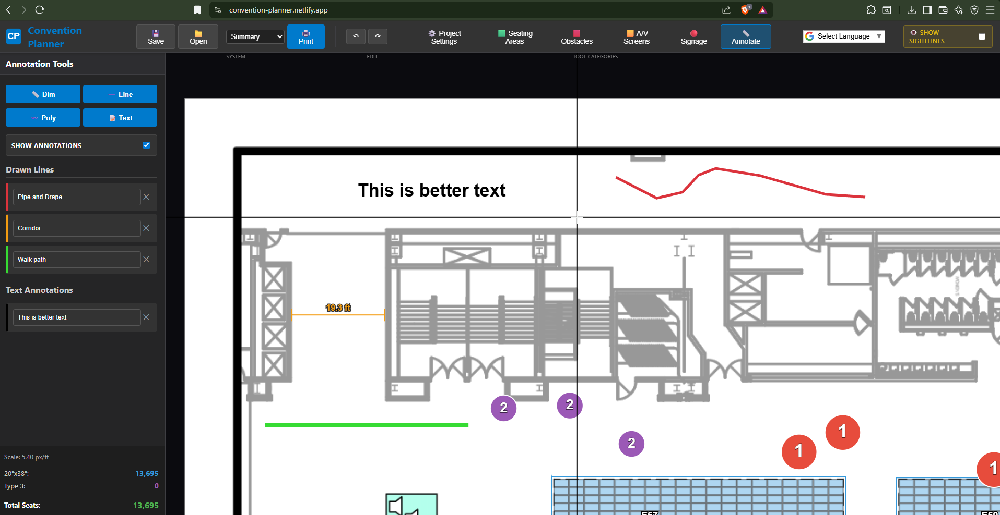
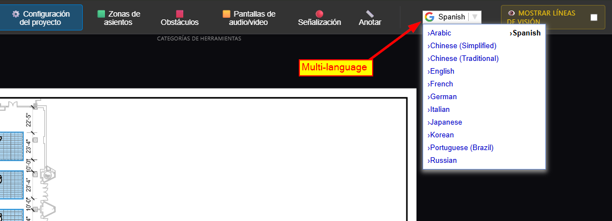
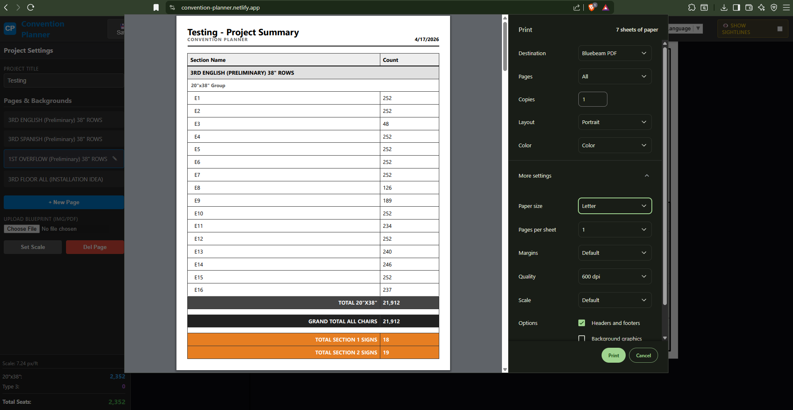

# Convention Planner

A lean, high-performance, browser-based logistics and mapping tool designed for large-scale event organization. 

Convention Planner allows event coordinators to import architectural floor plans, draw complex seating layouts, calculate capacities, and verify A/V sightlines for tens of thousands of attendees—all from a single, portable HTML file. It requires no installation, relying on a fully decoupled, client-side stack.

## 📸 Screenshots

### 1. Project Setup & Mapping

*Manage multiple floor plans and calibrate your digital scale (pixels per foot) for precise dimensioning.*

### 2. Seating & Capacity Planning

*Draw polygonal sections to automatically generate chair counts based on custom seat profiles.*

### 3. A/V Sightline Analysis (Raycasting)

*Place screens with adjustable beam angles to visualize line-of-sight and identify obstructed seats.*

### 4. Physical Obstacles

*Map out structural pillars or staging that automatically blocks sightlines and adjusts seat counts.*

### 5. Signage & Wayfinding

*Drop color-coded signage nodes and manage a dynamic, drag-and-drop map legend.*

### 6. Professional Annotation

*Add dimension lines, polylines, and text markups directly over the architectural blueprint.*

### 7. Multilingual Support

*Instantly toggle the UI between English, Spanish, French, Italian, Japanese, and Mandarin.*

### 8. Reporting & Logistics

*Generate professional PDF reports breaking down chair counts by section, profile, and language.*

---

## 🚀 Core Features

* **Dynamic Seating Calculation:** Automatic chair counts based on custom width/depth profiles.
* **A/V Sightline Analysis:** Real-time LOS visualization for screen placement.
* **Obstacle Occlusion:** Intelligent seat-blocking based on structural obstacles.
* **Blueprint Calibration:** Support for PDF, PNG, and JPG blueprint scaling.
* **Signage Management:** Node-based signage placement with auto-generated legends.
* **Reporting:** Print-ready summaries and hybrid layout maps for installation teams.
* **Zero-Install Portability:** A single HTML file that works entirely offline.

## 🛠️ Technologies Used

* **HTML5 Canvas:** High-performance rendering and real-time raycasting.
* **Vanilla JavaScript:** Fast, dependency-free execution.
* **PDF.js:** Client-side architectural blueprint rendering.
* **Google Translate API:** Dynamic UI localization.

## 🤝 Contributing

Contributions are welcome! If you have ideas for new features or improvements:
1. Fork the Project.
2. Create your Feature Branch (`git checkout -b feature/AmazingFeature`).
3. Commit your Changes (`git commit -m 'Add some AmazingFeature'`).
4. Push to the Branch (`git push origin feature/AmazingFeature`).
5. Open a Pull Request.

## ✉️ Contact

**Shane** – Abarca Services  
**Email:** [dev@abarca-services.com](mailto:dev@abarca-services.com)  
**Project Link:** [https://github.com/shanewall/Convention-Planner](https://github.com/shanewall/Convention-Planner)

## 📄 License

Distributed under the **GNU General Public License v3.0**. See `LICENSE` for more information.

This project is licensed under the **GNU General Public License v3.0 (GPL-3.0)**. 

This program is free software: you can redistribute it and/or modify it under the terms of the GNU General Public License as published by the Free Software Foundation. See the `LICENSE` file for more details.
